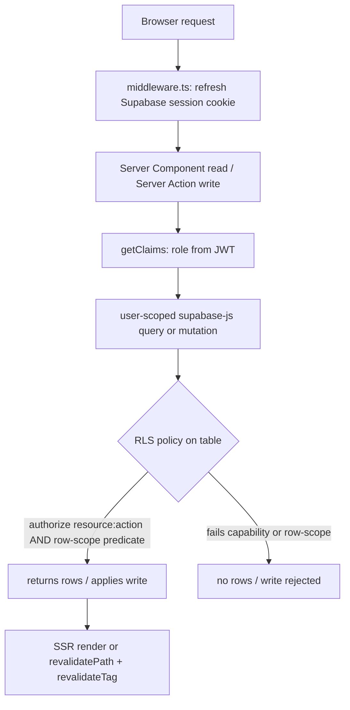
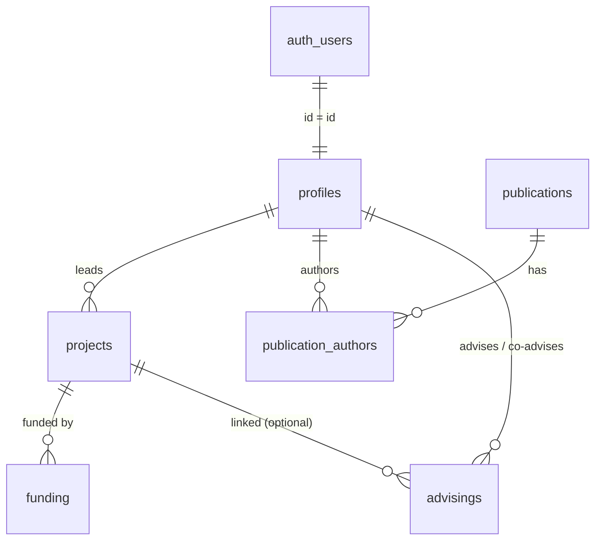

# feat: Rebuild SGPPF on Next.js + Supabase (v1)

**Target repo:** this repository (SGPPF_Maua). The new application lives in a new top-level `web/` directory,
alongside the legacy `back/` and `front/`, which are not modified or removed by this plan.

## Summary
Rebuild SGPPF from scratch as a single SSR Next.js + Supabase app under `web/`. A permission-driven CRUD core
serves researchers, projects, publications, advising, and funding; Supabase RLS is the only security gate;
dashboards read SQL views; publications enter primarily by DOI. v1 ships three roles (Admin, Researcher,
Consultant); the sector/coordinator layer is structured to drop in later. Built in five phases: foundation, the
Researchers slice (establishes the per-entity pattern), Publications + DOI, the remaining entities, and the
dashboard + CSV export.

## Problem Frame
The legacy build (FastAPI + React) enforces no auth on data endpoints, ships a hardcoded secret, drives live
screens from mock data, leaves forms unwired, and can't edit three entities; its data model was poorly generated.
The decision (see `origin: docs/brainstorms/2026-06-06-sgppf-rebuild-requirements.md`) is a clean rebuild that keeps
the feature essence and discards the old implementation and schema. This plan is the HOW for that v1. Because RLS is
the only security gate, the security invariants in the KTDs and the Testing Posture section are load-bearing, not optional.

---

## Key Technical Decisions

- KTD1. **Permission-based RBAC, seeded not runtime.** Capability is a Postgres enum `app_permission`
  (`resource:action`); roles are an `app_role` enum; a `role_permissions` table is seeded in a migration. A Supabase
  Custom Access Token Hook injects the user's role into the JWT; a SQL `authorize(app_permission)` function reads
  `role_permissions`. No runtime permissions-admin UI in v1. The app-side `can()` helper (for nav/UI only) derives
  visibility from the JWT role, never a hand-copied mirror of the seed — keeping nav and RLS from drifting. (Carries
  R8.) **Open fork (see Open Questions): role-only vs. role+permission-set in the JWT claim.**
- KTD2. **RLS is the only security gate, default-deny.** Every table has RLS enabled with explicit policies; a table
  with no policy denies. Policies combine `authorize('<resource>:<action>')` with a row-scope predicate. A
  RLS-coverage test fails CI if any public table has `rowsecurity = false` or lacks a policy. The
  **`service_role`/secret key is forbidden on user-facing paths**: Server Components and Server Actions read/write
  only through the user-scoped client (publishable key + the user's JWT from cookies); the secret key lives in the
  server env schema and is referenced only under `web/supabase/` scripts, never imported into `src/` (CI grep guard).
  Server Actions re-check `auth.getClaims()` for defense-in-depth; the app layer uses permissions only to show/hide
  UI and redirect forbidden deep-links. (Carries R9, R10.)
- KTD3. **Capability and row-scope are two layers.** Permissions gate *which resource+action*; a separate predicate
  gates *which rows*. v1: any authenticated user reads all *active* rows (read-all, institutional transparency);
  create/update/delete are self-scoped via the owning column (`= auth.uid()`) for researchers, unrestricted for admin.
- KTD4. **One app, no API layer.** Server Components read Supabase directly using PostgREST nested `select()` (no ORM,
  no hand-written joins); Server Actions write. No `/api` routes, no services/axios, no client data-fetching library,
  no global store. List view-state lives in URL `searchParams` with a canonical contract — `q` (search), `sort`,
  `dir`, `page`, `perPage` — consumed by a shared `query.ts`; each entity declares a filter→column map. Session lives
  in cookies via one `middleware.ts`. (Carries R1, R16.)
- KTD5. **Database is the single source of truth for types.** Schema lives in `web/supabase/migrations/`; run
  `supabase gen types typescript` into `web/src/lib/database.types.ts`; zod schemas derive from the generated row
  types. **Write** schemas omit server-managed columns (`id`, `created_at`, `updated_at`, generated `pending_amount`,
  and `role`); one zod schema validates both the client form (RHF) and the server action (`safeParse`). (Carries R13, R15.)
- KTD6. **Shared CRUD primitives composed explicitly.** A shared `action()` wrapper (auth + `safeParse` + typed
  `{errors}` + **both** scoped `revalidatePath` *and* `revalidateTag(entity)`), a shared `<DataTable>` (column config
  + the `query.ts` contract; "scoped to a parent" = a pre-filtered query, not a special mode), and a shared
  `<EntityForm>` (flat scalar/enum/FK-select fields, one zod schema, one Server Action). **Boundary rule:**
  child-collection editors (authorship), parent-scoped sub-resources (funding tab), and alternate ingest flows (DOI)
  are sibling per-entity components, **not** features absorbed into the shared primitives. No runtime/metadata
  generator. (Carries R14.)
- KTD7. **DOI import is a Next.js Server Action calling Crossref**, not a Supabase Edge Function. It links **the
  caller** (`auth.uid()`) as an author, dedupes on unique `doi`, and on an existing DOI updates only a Crossref-sourced
  allow-list (never curated fields, never existing authors). (Carries R17, R18.)
- KTD8. **Aggregations are RLS-respecting Postgres views/RPC**, created `with (security_invoker = true)` so they apply
  the caller's RLS (a normal view would bypass it). Read once per page by cached Server Components
  (`use cache` + `cacheTag`), invalidated by the `action()` tag on write. One source per KPI — a view **or**
  `count:'exact'`, never mixed. No client-side aggregation, no mock data. (Carries R19.)
- KTD9. **shadcn/ui Base UI variant; server-driven tables (no TanStack in v1).** Initialize shadcn selecting the
  Base UI registry per the current shadcn CLI; the choice is recorded in `components.json` and is immutable
  afterward. Sort/filter/pagination are SQL + `searchParams`. (Carries R3, R16.)
- KTD10. **Auth is Microsoft (Azure) SSO only**, single-tenant, restricted to the Mauá email domain. Domain
  restriction is enforced **server-side** in `handle_new_user()` (raises on a non-Mauá email, aborting provisioning) —
  the sign-in button's `domain_hint` is UX only, never the boundary. Google dropped, no email/password sign-up. First
  admin is a manually-created Supabase user. (Carries R6, R7.)
- KTD11. **English code, Brazilian-Portuguese UI via a labels map.** No hardcoded UI strings in components — pt-BR copy
  comes from `web/src/lib/labels.ts`, including a defined empty-state key namespace (see U1). (Carries R4.)
- KTD12. **bun toolchain + t3-env build-time validation; Cache Components enabled.** bun for install/run/scripts
  (`bun db:reset`) and tests (`bun:test`); env validated in `next.config.ts` so a missing/invalid var fails the build;
  `cacheComponents: true` is set in `next.config.ts` (prerequisite for `use cache`/`cacheTag` in U12). (Carries R2.)
- KTD13. **Profiles are never hard-deleted.** `researchers:delete` flips `is_active`; all reads/lists/selects filter
  `is_active = true` by default. Hard-deleting an `auth.users` row is an out-of-band admin operation, not a product
  path — and is blocked anyway by `on delete restrict` on owned rows (see Data Model). This protects authorship and
  project history from silent loss.

---

## High-Level Technical Design

**Request / security path** — every authenticated request flows through one middleware and lands on RLS:



**v1 data model** — entity relationships (full DDL in the next section; v1.1 tables omitted):



---

## Output Structure

```text
web/
  package.json  next.config.ts  tsconfig.json  components.json  middleware.ts
  supabase/
    config.toml
    migrations/            # 0001_enums, 0002_tables, 0003_rbac, 0004_rls_baseline,
                           # 0005_views, 0006_triggers, then per-entity RLS (0007_rls_profiles, ...)
    seed.sql               # roles, role_permissions, demo rows (fixed IDs + on conflict)
  src/
    env.ts                 # t3-env + zod (secret key in server schema only)
    lib/
      supabase/            # server.ts, client.ts, middleware.ts  (user-scoped only)
      database.types.ts    # generated
      crud/                # action.ts, data-table.tsx, entity-form.tsx, query.ts, confirm-dialog.tsx
      labels.ts            # pt-BR UI copy (incl. empty-state namespace)
      permissions.ts       # can() from the JWT role (logic, not a copy of the seed)
    app/
      (auth)/login/        # page.tsx, _components/
      (app)/
        layout.tsx         # shell + permission-scoped nav
        _components/        # nav.tsx, export-button.tsx
        dashboard/         # page.tsx, _components/
        researchers/       # page.tsx, [id]/, _components/, _actions/
        projects/          # page.tsx, [id]/ (funding tab), _components/, _actions/
        publications/      # page.tsx, [id]/, _components/ (doi import), _actions/
        advisings/         # page.tsx, [id]/, _components/, _actions/
        admin/             # page.tsx, _actions/ (user role assignment)
```

The tree is a scope declaration, not a constraint. Per-unit `**Files:**` lists remain authoritative.

---

## Data Model (v1 schema)

Directional DDL for the migrations. PKs `bigint generated always as identity`; `profiles.id` is `uuid` =
`auth.users.id`; enums introspected to TS via `gen types`; `updated_at` auto-maintained and `created_at` immutable
(both via triggers in 0006). **Migration ordering is dependency-driven:** enums → tables+constraints → RBAC
(`role_permissions` + `authorize()` + access-token hook) → RLS (baseline deny-all, then per-entity policies) → views →
triggers. RBAC precedes RLS because policies call `authorize()`. v1.1 tables (`research_groups`, `group_memberships`,
`project_members`, `project_publications`, `audit_log`) are out of scope.

```sql
-- enums (0001) — enum values are effectively append-only in Postgres; confirm sets before shipping (see Open Questions)
create type app_role         as enum ('admin','researcher','consultant');           -- 'coordinator' added in v1.1
create type app_permission   as enum (
  'researchers:read','researchers:write','researchers:delete',
  'projects:read','projects:write','projects:delete',
  'publications:read','publications:write','publications:delete',
  'advisings:read','advisings:write','advisings:delete',
  'funding:read','funding:write','funding:delete',
  'users:manage');
create type project_status   as enum ('planned','in_progress','completed','cancelled');
create type advising_status  as enum ('in_progress','completed','cancelled');
create type advising_level   as enum ('scientific_initiation','undergraduate_thesis','masters','doctorate','postdoc');
create type publication_type as enum ('article','conference_paper','book','book_chapter','technical_report','patent');
create type funding_status   as enum ('approved','in_execution','completed','cancelled');

-- core (0002)
create table profiles (
  id uuid primary key references auth.users(id) on delete cascade,
  full_name text not null, email text not null unique, role app_role not null default 'researcher',
  position text, area_of_expertise text, orcid text unique, lattes_url text, google_scholar_id text,
  employment_type text, affiliation_date date, is_active boolean not null default true,
  created_at timestamptz not null default now(), updated_at timestamptz not null default now());
  -- 'role' is privilege-bearing: never self-writable (see RLS + trigger guard, U4/U7)

create table projects (
  id bigint generated always as identity primary key,
  title text not null, code text unique, modality text,
  status project_status not null default 'in_progress',
  lead_id uuid not null references profiles(id) on delete restrict,   -- blocks hard-delete of a lead; soft-delete instead
  start_date date, end_date date,
  created_at timestamptz not null default now(), updated_at timestamptz not null default now(),
  constraint projects_dates_ck check (end_date is null or end_date >= start_date));

create table publications (
  id bigint generated always as identity primary key,
  title text not null, doi text unique, type publication_type, year smallint, venue text, issn text, url text,
  qualis text, impact_factor numeric(6,3), citation_count integer, knowledge_area text, authors_text text,
  created_at timestamptz not null default now(), updated_at timestamptz not null default now());

create table publication_authors (
  id bigint generated always as identity primary key,
  publication_id bigint not null references publications(id) on delete cascade,
  profile_id uuid not null references profiles(id) on delete restrict,  -- restrict: authorship history must not vanish
  author_position smallint, is_corresponding boolean not null default false,
  unique (publication_id, profile_id),
  unique (publication_id, author_position));                            -- no duplicate positions
create unique index publication_one_corresponding
  on publication_authors (publication_id) where is_corresponding;       -- at most one corresponding author

create table advisings (
  id bigint generated always as identity primary key,
  student_name text not null, level advising_level not null, work_title text,
  status advising_status not null default 'in_progress',
  advisor_id uuid not null references profiles(id) on delete restrict,
  co_advisor_id uuid references profiles(id) on delete set null,
  project_id bigint references projects(id) on delete set null,
  scholarship_agency text, start_date date, end_date date,
  created_at timestamptz not null default now(), updated_at timestamptz not null default now(),
  constraint advisings_dates_ck check (end_date is null or end_date >= start_date));

create table funding (
  id bigint generated always as identity primary key,
  project_id bigint not null references projects(id) on delete cascade,
  agency text not null, modality text,
  approved_amount numeric(14,2) not null default 0 check (approved_amount >= 0),
  received_amount numeric(14,2) not null default 0 check (received_amount >= 0),
  pending_amount numeric(14,2) generated always as (approved_amount - received_amount) stored,
  currency text not null default 'BRL' check (currency = 'BRL'),        -- single-currency v1; multi-currency deferred
  status funding_status not null default 'approved',
  start_date date, end_date date,
  created_at timestamptz not null default now(), updated_at timestamptz not null default now(),
  constraint funding_dates_ck check (end_date is null or end_date >= start_date));
  -- over-receipt (received > approved) is allowed; pending_amount may be negative by design

-- rbac (0003)
create table role_permissions (role app_role not null, permission app_permission not null, primary key (role, permission));
```

`authorize(p app_permission)` returns `exists (select 1 from role_permissions where role = (auth.jwt()->>'user_role')::app_role and permission = p)`.
The access-token hook and `authorize()` are created in 0003, before any RLS policy references them. `0004` enables RLS
on every table with a **deny-all baseline**; each entity unit then adds its policies in a per-entity RLS migration.

---

## Implementation Units

### Phase 1 — Foundation

### U1. Scaffold the Next.js app under `web/`
- **Goal:** A runnable Next.js (latest) App Router project on bun with Tailwind, shadcn/ui (Base UI), t3-env, and Cache Components enabled.
- **Requirements:** R1, R2, R3, R4 (KTD9, KTD11, KTD12)
- **Dependencies:** none
- **Files:** `web/package.json`, `web/next.config.ts`, `web/tsconfig.json`, `web/components.json`, `web/src/env.ts`, `web/src/app/layout.tsx`, `web/src/app/globals.css`, `web/src/lib/labels.ts`
- **Approach:** `bun create next-app` in `web/` (App Router, TS, `src/`, Tailwind). Init shadcn selecting the Base UI registry (current shadcn CLI; the choice is recorded in `components.json` and is immutable). In `next.config.ts` set `cacheComponents: true` (prerequisite for `use cache`/`cacheTag` used in U12) and import `env.ts` so validation runs at build. `src/env.ts` (t3-env): Supabase URL + publishable key in the **client** schema, the secret key in the **server** schema only. Seed `labels.ts` with shell strings **and a defined empty-state namespace** — `empty.<entity>.title`/`.description` for `researchers`/`projects`/`publications`/`advisings`/`funding`, and `empty.dashboard.<kpi>` plus error-message keys (`errors.required`, `errors.duplicate`) and dialog keys (`dialogs.confirm_delete.*`) — with real pt-BR copy, so U7–U14 reference keys rather than inventing strings.
- **Patterns to follow:** t3-env `createEnv({ server, client, runtimeEnv })`; shadcn Base UI init; Next.js `cacheComponents`.
- **Test scenarios:** Test expectation: none -- scaffolding/config. Verify by build: `bun run build` fails when a required env var is unset (smoke-checks R2).
- **Verification:** `bun dev` serves; `bun run build` passes with env set and fails without; `cacheComponents` is enabled.

### U2. Supabase clients + session middleware
- **Goal:** SSR-correct, user-scoped Supabase access: server client, browser client, and cookie-refresh middleware.
- **Requirements:** R1, R6, R10 (KTD2, KTD4)
- **Dependencies:** U1
- **Files:** `web/src/lib/supabase/server.ts`, `web/src/lib/supabase/client.ts`, `web/src/lib/supabase/middleware.ts`, `web/middleware.ts`
- **Approach:** `@supabase/ssr` — `createServerClient` (wired to `next/headers` cookies, publishable key) for RSC/Actions, `createBrowserClient` for client components, and middleware calling `getClaims()` to refresh and write cookies back to request and response. Propagate the cache headers from the cookie `setAll` callback (CDN session-leak guard). The secret key is **not** used here or anywhere in `src/`. The Supabase project must use **asymmetric JWT signing keys** so `getClaims()` verifies locally (without them it is a network round-trip on every call — see Risks).
- **Patterns to follow:** Supabase `@supabase/ssr` App Router three-file setup; `getClaims()` not `getSession()` in server code.
- **Test scenarios:**
  - Happy path: an authenticated request passes middleware and `getClaims()` returns claims.
  - Edge: an expired-but-refreshable session is refreshed and the new cookie written to the response.
  - Error: an unauthenticated request to a protected path redirects to `/login`.
- **Verification:** `(app)` routes redirect unauthenticated; authenticated requests resolve claims server-side via the user-scoped client.

### U3. Database schema: migrations, constraints, seed, generated types
- **Goal:** The full v1 schema as dependency-ordered migrations, an idempotent seed, and generated TS types.
- **Requirements:** R5, R11, R12, R13 (KTD5, KTD13, data-integrity)
- **Dependencies:** U2
- **Files:** `web/supabase/migrations/0001_enums.sql`, `web/supabase/migrations/0002_tables.sql`, `web/supabase/seed.sql`, `web/src/lib/database.types.ts`, `web/package.json` (`db:reset`, `db:types` scripts)
- **Approach:** Author 0001 (enums) and 0002 (tables) per the Data Model section — including the check constraints (amounts ≥ 0, `currency = 'BRL'`, `end_date >= start_date`), the `publication_authors` uniqueness (per-author, per-position, one-corresponding partial index), and the `on delete` semantics (`restrict` on `lead_id`/`advisor_id`/`publication_authors.profile_id`; `cascade` on `funding.project_id`; `set null` on `co_advisor_id`/`advisings.project_id`). `seed.sql` uses **fixed UUIDs + `on conflict do nothing/update`** so it is safe to re-run; seeding `profiles` first inserts the matching `auth.users` rows. Scripts: `bun db:reset` (`supabase db reset` → migrate + seed), `bun db:types` (`supabase gen types typescript` → `database.types.ts`). Requires the `supabase` CLI + Docker (see Risks).
- **Execution note:** Confirm the enum value sets (Open Questions) before authoring 0001 — enum values are append-only in Postgres.
- **Patterns to follow:** Supabase local migrations + `seed.sql` + `gen types`.
- **Test scenarios:**
  - Happy path: `bun db:reset` applies cleanly from empty; the seed is idempotent (run `seed.sql` twice → zero errors, no duplicate rows).
  - Edge: a duplicate `doi`/`email`/`orcid`/`code` is rejected; two authors at the same `author_position` on one publication are rejected; a second `is_corresponding` author is rejected.
  - Edge: `funding` rejects negative amounts and a non-BRL currency; `end_date < start_date` is rejected on projects/advisings/funding; `pending_amount` equals `approved - received` (incl. negative when over-received).
  - Edge: a status column rejects an out-of-enum value.
- **Verification:** `database.types.ts` regenerates with all v1 tables/enums; constraints reject bad data; seed re-runs cleanly.

### U4. RBAC primitives + access-token hook
- **Goal:** Roles → permissions mapping, JWT role injection, and `authorize()`.
- **Requirements:** R8 (KTD1)
- **Dependencies:** U3
- **Files:** `web/supabase/migrations/0003_rbac.sql`, `web/supabase/seed.sql` (extend), `web/src/lib/permissions.ts`
- **Approach:** Create `role_permissions`; seed the v1 map with `on conflict do nothing` — admin: all + `users:manage`; researcher: `*:read` + `*:write` + own-row `*:delete`; consultant: `*:read`. Register the Custom Access Token Hook injecting `user_role` into the JWT (see Open Questions for the role-only vs. role+permission-set fork). Define `authorize(app_permission)` reading `role_permissions` against the JWT role (created here, before any RLS uses it). `src/lib/permissions.ts` exposes `can(perm)` for nav/UI, derived from the JWT role.
- **Patterns to follow:** Supabase RBAC custom-claims pattern (`role_permissions` + access-token hook + `authorize()`).
- **Test scenarios:**
  - Happy path: `authorize('projects:write')` is true for admin and researcher, false for consultant (run as each role).
  - Covers AE3. A consultant calling any `:write` action is denied by RLS (the consultant role has no `:write` permission) and no row is written — proves capability gating and that `action()` does not bypass RLS.
  - Edge: a role with no matching row yields false; `users:manage` is true only for admin.
  - Integration: a researcher's JWT carries `user_role = researcher`; `can()` reads it without a DB round-trip.
- **Verification:** SQL tests over `authorize()` pass for all three roles; the consultant-write denial holds; the hook populates the role claim.

### U5. Auth: Microsoft SSO, login, provisioning, route groups
- **Goal:** Microsoft-only sign-in restricted server-side to the Mauá domain, JIT profile provisioning, and `(auth)`/`(app)`.
- **Requirements:** R6, R7, R10 (KTD10)
- **Dependencies:** U2, U3, U4
- **Files:** `web/src/app/(auth)/login/page.tsx`, `web/src/app/(auth)/login/_components/sign-in-button.tsx`, `web/src/app/(auth)/layout.tsx`, `web/src/app/(app)/layout.tsx`, `web/supabase/migrations/0006_triggers.sql` (`handle_new_user`, `updated_at`/`created_at` triggers)
- **Approach:** Configure a **single-tenant** Supabase Azure provider. Login is one `signInWithOAuth({ provider: 'azure' })` (`domain_hint` is UX only). `handle_new_user()` runs on `auth.users` insert: it **validates the email domain server-side** (raises on non-Mauá, aborting the insert) and otherwise creates the `profiles` row (full_name + email from SSO metadata, role `researcher`). The `(app)` layout reads `getClaims()` and redirects unauthenticated users; forbidden deep-links (missing `:read`) redirect to dashboard. 0006 also installs the `moddatetime` `updated_at` trigger on all six tables and a `created_at`-immutability guard trigger.
- **Execution note:** Start with an integration test for provisioning + domain rejection (insert into `auth.users` → profile appears for a Mauá email, raises for a non-Mauá email).
- **Patterns to follow:** Supabase Azure OAuth + `handle_new_user` trigger; middleware guard from U2.
- **Test scenarios:**
  - Covers AE5. First Microsoft sign-in for a Mauá email creates one `profiles` row (role `researcher`) and lands authenticated.
  - Error: a non-Mauá email is refused **at the trigger** (no `profiles` row appears even if OAuth completed).
  - Edge: a second sign-in does not duplicate the profile; `created_at` is unchanged after later updates.
  - Integration: unauthenticated `/projects` → `/login`; consultant `/admin` → `/dashboard`.
- **Verification:** SSO provisions exactly one profile for Mauá emails, rejects others server-side; redirects hold.

### U6. Shared CRUD primitives + app shell
- **Goal:** The reusable CRUD layer (`action()`, `<DataTable>`, `<EntityForm>`, `query.ts`, confirm dialog) and the permission-scoped shell/nav. Primitives are unit-proven here; first end-to-end CRUD proof is U7.
- **Requirements:** R14, R16, R21 (KTD6, KTD4, KTD9)
- **Dependencies:** U2, U4, U5
- **Files:** `web/src/lib/crud/action.ts`, `web/src/lib/crud/data-table.tsx`, `web/src/lib/crud/entity-form.tsx`, `web/src/lib/crud/query.ts`, `web/src/lib/crud/confirm-dialog.tsx`, `web/src/app/(app)/layout.tsx`, `web/src/app/(app)/_components/nav.tsx`, `web/src/lib/crud/action.test.ts`
- **Approach:** `action()` wraps a Server Action: `getClaims()` auth check → `schema.safeParse` → typed `{ errors }` on failure (never throws across the boundary) → run handler → scoped `revalidatePath` **and** `revalidateTag(entity)` (the per-entity tag namespace `profiles|projects|publications|funding|advisings` is the contract between writes and cached reads — established now, consumed by the dashboard in U12). `query.ts` builds the user-scoped Supabase select from the canonical `searchParams` (`q`/`sort`/`dir`/`page`/`perPage`) + an entity filter→column map (server-paginated). Three shared UX contracts every entity inherits:
  - **Form errors:** field-level errors render inline below the input (shadcn `<FormMessage>`); server-returned `{errors}` merge into RHF via `setError` after the action returns; validation fires on submit; messages come from `labels.ts` error keys.
  - **Destructive actions:** a shared `<ConfirmDialog>` (shadcn `<AlertDialog>`, pt-BR copy from `dialogs.confirm_delete.*`) gates every delete/soft-delete, triggered from list-row and detail actions.
  - **Nav visibility:** Dashboard always visible; Researchers/Projects/Publications/Advisings gated on the matching `:read`; Admin on `users:manage`. v1 result: Admin sees all; Researcher and Consultant see all but Admin.
- **Patterns to follow:** Server Actions best practices (typed errors, shared zod, revalidate); shadcn `<Form>`/`<AlertDialog>` + RHF + `zodResolver`.
- **Test scenarios:**
  - Happy path: `action()` runs the handler and returns success on valid+authorized input; it calls both `revalidatePath` and `revalidateTag`.
  - Edge: invalid input returns typed `{ errors }` keyed by field, does not call the handler, never throws across the boundary.
  - Error: an unauthenticated call returns an auth error without running the handler.
  - Integration: nav omits "Administração" for a consultant and shows it for an admin; the confirm dialog blocks a delete until confirmed.
- **Verification:** `action()` unit tests pass in isolation; primitives + nav + confirm dialog compile and render against the `profiles` shape. (End-to-end CRUD is proven in U7.)

### Phase 2 — First vertical slice

### U7. Researchers (profiles) CRUD — establishes the per-entity pattern
- **Goal:** Full CRUD over `profiles` through the shared primitives + `query.ts`, with RLS — the reference every later entity copies. Establishes the read-all + self-scope pattern that AE1/AE2 verify on projects (U10).
- **Requirements:** R9, R14, R15, R16, R21 (establishes KTD2, KTD3, KTD6, KTD13 end-to-end)
- **Dependencies:** U6
- **Files:** `web/src/app/(app)/researchers/page.tsx`, `web/src/app/(app)/researchers/[id]/page.tsx`, `web/src/app/(app)/researchers/_components/researcher-form.tsx`, `web/src/app/(app)/researchers/_actions/*.ts`, `web/src/lib/schemas/researcher.ts`, `web/supabase/migrations/0004_rls_baseline.sql` (enable RLS + deny-all for all v1 tables), `web/supabase/migrations/0007_rls_profiles.sql`, `web/src/app/(app)/researchers/researchers.test.ts`
- **Approach:** A `researcher.ts` zod **write** schema derived from the generated `profiles` row type, omitting `id`/`created_at`/`updated_at`/`role`. List/detail are Server Components routed through `query.ts` (default-filtering `is_active = true`; `q` searches `full_name ilike`); create/update/delete are `_actions` through `action()`. 0004 enables RLS + deny-all on every v1 table (default-deny from the start). `0007_rls_profiles`: read for `researchers:read`; insert/update/delete for `researchers:write/delete` with self-scope (`id = auth.uid()`) for researchers, unrestricted for `users:manage` (admin). **`role` is not self-writable**: a `before update` trigger raises if `role` changes and the caller lacks `users:manage` (RLS gates rows, not columns). `researchers:delete` flips `is_active`, never hard-deletes (confirmed via `<ConfirmDialog>`).
- **Patterns to follow:** the U6 primitives; this unit is the pattern for U8/U10/U11.
- **Test scenarios:**
  - A researcher sees all active researchers in the list but edit/delete act only on their own profile (the read-all + self-scope pattern; AE1/AE2 are verified on projects in U10).
  - A researcher's direct update of another profile is rejected by RLS, not just hidden.
  - **Escalation:** a researcher's self-update setting `role = 'admin'` is rejected; updating their non-privileged columns succeeds; only `users:manage` changes another user's `role`.
  - Happy path: an admin creates/edits a profile; soft-delete sets `is_active = false` and the row leaves the default list without removing their `publication_authors`/`projects`/`advisings`.
  - Edge: a duplicate `email`/`orcid` surfaces a field-level error; a write attempting to set `created_at` or a server-managed column is ignored; empty DB renders the pt-BR empty state (no mock rows).
- **Verification:** Profiles CRUD works for admin and self-scoped for researcher; escalation and column guards hold at the DB layer; soft-delete preserves history.

### Phase 3 — Publications + DOI

### U8. Publications CRUD + authorship
- **Goal:** CRUD over `publications` and `publication_authors` following U7.
- **Requirements:** R9, R15, R18 (KTD6)
- **Dependencies:** U7
- **Files:** `web/src/app/(app)/publications/page.tsx`, `web/src/app/(app)/publications/[id]/page.tsx`, `web/src/app/(app)/publications/_components/publication-form.tsx`, `web/src/app/(app)/publications/_components/authors-editor.tsx`, `web/src/app/(app)/publications/_actions/*.ts`, `web/src/lib/schemas/publication.ts`, `web/supabase/migrations/0008_rls_publications.sql`, `web/src/app/(app)/publications/publications.test.ts`
- **Approach:** Publications list/detail/form per U7 (`q` searches `title ilike` + `doi` exact). Authorship is a sibling child-collection editor (`authors-editor.tsx`, per KTD6 boundary), not part of `<EntityForm>`. RLS: read for `publications:read`; publication writes for `publications:write`. `publication_authors` write predicate is **self-link only** — a researcher may insert/delete only rows where `profile_id = auth.uid()`; editing other authors requires admin (`users:manage`).
- **Patterns to follow:** U7; the authorship editor is the reference for future child-collections.
- **Test scenarios:**
  - Happy path: create a publication, self-add as author with a position + corresponding flag; detail reflects ordering.
  - Edge: linking the same profile twice, or two authors at the same position, is rejected with a friendly error.
  - **Authorization:** a researcher cannot link a *different* profile as author, nor remove another researcher's authorship — rejected by RLS.
  - Covers AE1. A researcher editing a publication they don't author is rejected by RLS.
- **Verification:** Publications CRUD + self-scoped authorship works; cross-user authorship writes are denied.

### U9. DOI import (Crossref) as the primary entry path
- **Goal:** Paste-a-DOI → fetch metadata → confirm → save, deduping on `doi` without clobbering curated data.
- **Requirements:** R17, R18 (KTD7)
- **Dependencies:** U8
- **Files:** `web/src/app/(app)/publications/_actions/import-doi.ts`, `web/src/app/(app)/publications/_components/doi-import.tsx`, `web/src/lib/crossref.ts`, `web/src/app/(app)/publications/import-doi.test.ts`
- **Approach:** A Server Action takes a DOI, calls Crossref (`crossref.ts` maps response → publication shape: title, venue, ISSN, year, authors_text), returns metadata for a confirmation card; on confirm it upserts by `doi`. **On an existing DOI, update only a Crossref-sourced allow-list** (title, venue, issn, year, authors_text) and **never** overwrite curated fields (`qualis`, `impact_factor`, `citation_count`, `knowledge_area`) or touch existing `publication_authors`; surface "this DOI already exists — view it" rather than silently mutating. Links **the caller** as an author. Qualis stays manual. Uses the user-scoped client (RLS-gated). The `doi-import.tsx` component renders six explicit states, each mapped to a `labels.ts` key: idle (input + import button), loading (disabled + spinner), confirmation (mapped-fields card + Confirmar/Cancelar), existing-DOI (inline notice + "Ver publicação" link, no save), Crossref error (retriable message + "Inserir manualmente" fallback), saved (redirect to detail). No partial row on failure.
- **Execution note:** Start with a failing test for the Crossref-response → publication-shape mapping using a recorded fixture.
- **Patterns to follow:** `action()` wrapper; typed error returns.
- **Test scenarios:**
  - Covers AE4. Importing an existing DOI updates only the allow-list, leaves `qualis`/`impact_factor` and existing authors untouched, and creates no duplicate (renders the existing-DOI state).
  - Happy path: a valid new DOI returns mapped metadata (confirmation state); on confirm a publication is created and the importer linked as author (saved state).
  - **Authorization:** a consultant (no `publications:write`) calling import is rejected by RLS (canary that the service_role key isn't in use).
  - Error: Crossref timeout/4xx renders the retriable error state + manual entry; no partial row. Edge: a DOI missing ISSN imports with that field null and `qualis` blank.
- **Verification:** Import creates/updates correctly, never clobbers curated data or authors, dedupes, renders all six states, and degrades to manual entry.

### Phase 4 — Remaining entities

### U10. Projects CRUD (with Funding tab)
- **Goal:** CRUD over `projects` following U7, with funding managed inline on the project detail page.
- **Requirements:** R9, R15, R22 (KTD6)
- **Dependencies:** U7
- **Files:** `web/src/app/(app)/projects/page.tsx`, `web/src/app/(app)/projects/[id]/page.tsx`, `web/src/app/(app)/projects/_components/project-form.tsx`, `web/src/app/(app)/projects/_components/funding-tab.tsx`, `web/src/app/(app)/projects/_actions/*.ts`, `web/src/lib/schemas/project.ts`, `web/src/lib/schemas/funding.ts`, `web/supabase/migrations/0009_rls_projects.sql`, `web/src/app/(app)/projects/projects.test.ts`
- **Approach:** Projects list/detail/form per U7 (self-scope `lead_id = auth.uid()`; `q` searches `title ilike` + `code` exact). The detail page's "Financiamentos" tab is a sibling parent-scoped sub-resource (per KTD6 boundary): a `<DataTable>` pre-filtered to the project, an empty state (`empty.funding.*`), an "Adicionar Financiamento" action visible only to project lead or admin, and an **inline** `<EntityForm>` below the table (not a dialog, not a route) whose Server Action is scoped to `project_id`; success re-renders via `revalidatePath`/`revalidateTag`. **Funding RLS does not "inherit"** — its policy re-derives the parent: researcher writes allowed only where `exists (select 1 from projects p where p.id = funding.project_id and p.lead_id = auth.uid())`; unrestricted for admin.
- **Patterns to follow:** U7; funding-tab is the reference for parent-scoped sub-resources.
- **Test scenarios:**
  - Covers AE2. A researcher sees all projects (read-all) but edit/delete act only on projects they lead.
  - Happy path: create a project; add two funding contracts inline; the tab shows `pending_amount` per contract and an empty state when none.
  - **Authorization:** a researcher cannot insert/edit funding on a project they don't lead — rejected by RLS.
  - Covers AE1. A researcher editing a project they don't lead is rejected by RLS.
  - Edge: deleting a project cascades its funding; `end_date < start_date` is rejected.
- **Verification:** Project CRUD + inline funding works; funding writes are project-lead-scoped at the DB.

### U11. Advisings CRUD
- **Goal:** CRUD over `advisings` following U7, with optional project link and co-advisor.
- **Requirements:** R9, R15 (KTD6)
- **Dependencies:** U7, U10 (optional `project_id` link)
- **Files:** `web/src/app/(app)/advisings/page.tsx`, `web/src/app/(app)/advisings/[id]/page.tsx`, `web/src/app/(app)/advisings/_components/advising-form.tsx`, `web/src/app/(app)/advisings/_actions/*.ts`, `web/src/lib/schemas/advising.ts`, `web/supabase/migrations/0010_rls_advisings.sql`, `web/src/app/(app)/advisings/advisings.test.ts`
- **Approach:** Per U7 (`q` searches `student_name ilike`). `advisor_id = auth.uid()` self-scopes researcher writes; `co_advisor_id`/`project_id` are optional selects; `level`/`status` are enum-backed selects from generated types. Active-researcher filter on the advisor/co-advisor pickers.
- **Patterns to follow:** U7.
- **Test scenarios:**
  - Happy path: create an advising (level `masters`, advisor self, optional co-advisor + linked project).
  - Edge: clearing the linked project sets `project_id` null without deleting the advising; `end_date < start_date` rejected.
  - Covers AE1. A researcher editing an advising where they are neither advisor is rejected by RLS.
- **Verification:** Advisings CRUD works; optional links and enums behave; RLS self-scope holds.

### Phase 5 — Dashboard, export, admin

### U12. Dashboard: KPI views + cached SSR page
- **Goal:** A dashboard reading RLS-respecting Postgres views with honest empty states.
- **Requirements:** R5, R19 (KTD8)
- **Dependencies:** U7, U8, U10, U11
- **Files:** `web/supabase/migrations/0005_views.sql`, `web/src/app/(app)/dashboard/page.tsx`, `web/src/app/(app)/dashboard/_components/kpi-card.tsx`, `web/src/lib/data/kpis.ts`, `web/src/app/(app)/dashboard/dashboard.test.ts`
- **Approach:** Define views/RPC for the KPIs (total publications, publications last 3 years, total/completed advisings, active funded projects, total funds received), each `with (security_invoker = true)` so they respect the caller's RLS. `kpis.ts` reads them in a cached data fn (`use cache` + `cacheTag` per entity; requires `cacheComponents: true` from U1); invalidation comes from the `action()` `revalidateTag` established in U6 — this unit consumes that contract. One source per KPI (a view or `count:'exact'`, not mixed). "Funds captured" sums `received_amount` (single-currency BRL). Zero values render pt-BR empty/zero states (`empty.dashboard.*`).
- **Patterns to follow:** Next.js `use cache`/`cacheTag`; the U6 tag namespace.
- **Test scenarios:**
  - Covers AE6. Empty DB renders all KPIs at `0`/empty with no mock data and no error.
  - Happy path: seeded data produces correct counts/sums (assert "funds captured" sums `received_amount`, not `approved_amount`).
  - Edge: "publications last 3 years" excludes older rows at the boundary year.
  - **Security:** querying a KPI view as a role lacking the relevant `:read` permission returns empty/zero, not the global count (proves `security_invoker`).
  - Integration: creating a publication and revalidating its tag updates the dashboard count on next read.
- **Verification:** KPIs match SQL truth; `security_invoker` holds; cache invalidation reflects writes; empty states honest.

### U13. CSV export on filtered lists
- **Goal:** A shared "Exportar CSV" action exporting the current filtered list view.
- **Requirements:** R20 (KTD8)
- **Dependencies:** U7, U8, U10, U11
- **Files:** `web/src/lib/crud/export-csv.ts`, `web/src/app/(app)/_components/export-button.tsx`, `web/src/lib/crud/export-csv.test.ts`
- **Approach:** A shared export reads the same `query.ts` (same `searchParams`) as the list so the export matches what's on screen, then streams a CSV via the user-scoped client (RLS-gated). Wire `<ExportButton>` into each list toolbar. Resolve server-streamed vs client-built during implementation (Open Questions).
- **Patterns to follow:** the shared `query.ts` from U6 (single source for list filters).
- **Test scenarios:**
  - Happy path: exporting a filtered publications list yields a CSV whose rows match the filtered query.
  - Edge: an empty filtered set yields a header-only CSV; fields with commas/quotes are correctly escaped.
  - Security: export respects RLS (a consultant exports only what they can read).
- **Verification:** CSV content equals the filtered list across at least two entities.

### U14. Admin: user role assignment
- **Goal:** The single `users:manage` surface — admins view all profiles and change a user's role.
- **Requirements:** R8, R10 (KTD1, KTD13)
- **Dependencies:** U6, U7
- **Files:** `web/src/app/(app)/admin/page.tsx`, `web/src/app/(app)/admin/_components/role-select.tsx`, `web/src/app/(app)/admin/_actions/update-role.ts`, `web/src/app/(app)/admin/admin.test.ts`
- **Approach:** The Admin page (gated on `users:manage`; middleware redirects others to dashboard) lists all profiles — active and inactive — with their current role and an inline role `<select>` (`researcher`/`consultant`/`admin`). Changing it fires `update-role.ts` through `action()`, which performs the admin-scoped role change (the path allowed past the U7 `before update` trigger guard). Inline success/error state per row. No runtime permissions-map editing (only role assignment).
- **Patterns to follow:** U6 `action()`; U7 RLS (admin `users:manage` path).
- **Test scenarios:**
  - Happy path: an admin changes a researcher to consultant; the change persists and the row reflects it.
  - **Authorization:** a non-admin reaching `/admin` is redirected; a non-admin calling `update-role` directly is rejected by RLS.
  - Edge: changing a role takes effect on that user's next token refresh (document the staleness window; see Risks).
- **Verification:** Role assignment works for admins only; the trigger guard permits the admin path and blocks self-escalation.

---

## Testing Posture
The existing per-entity tests are owner-positive ("editing a row you don't own is denied"). Because RLS is the only
gate, add a **negative-authorization / escalation** category as load-bearing (treated like the RLS-denial scenarios):
self-role-escalation (U7), consultant-write denial (U4, AE3), cross-user authorship/funding writes (U8/U10), the
service-role canary (U9), and `security_invoker` on views (U12). Plus a **RLS-coverage sweep** (in U3/U7): a schema
test that enumerates `pg_tables`/`pg_policies` and fails if any public table has RLS disabled or lacks a policy — this
auto-covers the v1.1 tables when they land. RLS/SQL tests run under `bun:test` against the local Supabase stack and set
per-connection JWT claims/role to exercise policies as each role.

---

## Scope Boundaries

### Deferred for later (v1.1+)
- Coordenador de Setor role, `research_groups`, `group_memberships`, sector-scoped reads and finance rollup.
- `project_members` (teams), `project_publications` (project↔publication links), `audit_log`.
- Full Relatórios module: PDF export, scheduled/periodic reports, report builder.
- Multi-currency funding (currency is constrained to BRL in v1); promotion of `employment_type`/`modality` to enums (pending Mauá's value lists).

### Outside this product's identity / not now
- Legacy `requisitos` prescriptions (layered-architecture formalism, Power Apps, K8s/observability/CI-governance), the old DB field design — discarded.
- Supabase Realtime and file attachments/Storage (no v1 need).
- Future evolutions: mobile app, Power BI, Teams, AI productivity analysis, automated agency-report generation, editais integration.

### Deferred to Follow-Up Work (plan-local)
- The legacy `back/` and `front/` directories are left in place; their decommission is a separate task once `web/` reaches parity.

---

## Risks & Dependencies
- **RLS is the sole gate** — every entity unit carries negative-authorization tests, and the RLS-coverage sweep (Testing Posture) is a CI gate. A table shipped without a policy = legacy-grade exposure; the default-deny baseline (0004) prevents the window.
- **`service_role`/secret key discipline (KTD2)** — a single use on a user-facing path silently bypasses all RLS. Mitigate with server-only env placement and a CI grep that fails if the secret key appears under `src/`.
- **Supabase project prerequisites** — a Supabase project + single-tenant Azure AD registration (domain check enforced in `handle_new_user()`, not client config); the **`supabase` CLI + Docker** for the local stack (`bun db:reset`, `gen types`, the RLS/SQL tests); and **asymmetric JWT signing keys** so `getClaims()` verifies locally instead of a per-request network round-trip. Until provisioned, build against a manually-created test user.
- **JWT role staleness** — role changes (U14) propagate only on token refresh (≈ access-token TTL). Acceptable for v1 (rare changes), but revocation lags: deactivating a user (`is_active = false`) requires either an `authorize()`/policy check on `is_active` or explicit session/refresh-token revocation to take effect before TTL. State the TTL as the bounded revocation window.
- **Crossref reliability/rate limits (U9)** — external API; graceful failure + manual-entry fallback. Qualis is not in Crossref and stays manual; the DOI upsert never clobbers it.
- **Dashboard is the integration nexus (U12)** — it depends on every entity's `revalidateTag` (from U6's `action()`), on `cacheComponents: true` (U1), and on `security_invoker` views; validate it only after confirming each entity action tags correctly.
- **Base UI maturity / immutable `components.json`** — the U1 registry choice is a one-way door; pick deliberately.
- **Enum values are append-only in Postgres** — confirm sets at U3 before shipping; removing/renaming requires a type swap + table rewrite.

---

## Open Questions

### Resolve before/at U4
- **JWT claim shape (KTD1):** inject role-only (matches origin R8; `can()` derives UI from the 3-value role; `authorize()` reads `role_permissions` live) vs. role + resolved permission-set (lets `can()` read permissions straight off the JWT, at the cost of token size and a staleness snapshot). Default: role-only unless nav needs per-permission granularity beyond the role.

### Deferred to Planning/Implementation
- Exact enum value sets (`project_status`, `advising_level`, `publication_type`, `funding_status`, `app_permission`) — starter values are in the Data Model; confirm against Mauá usage before authoring 0001 (U3).
- `employment_type`/`modality` as starter enums vs. free text in v1 — default free text (U7/U10) until Mauá supplies lists.
- CSV export mechanism — server-streamed vs. client-built (settle in U13).

---

## Sources / Research
- `origin: docs/brainstorms/2026-06-06-sgppf-rebuild-requirements.md` and `docs/ideation/2026-06-06-sgppf-rebuild-ideation.md` — WHAT and the ranked rebuild blueprint.
- Legacy `back/app/models/`, `back/app/api/`, `front/src/pages/` — feature/essence source; explicitly not a pattern to follow.
- Stack patterns (gathered during ideation): `@supabase/ssr` SSR three-file setup and `getClaims()` (U2); Supabase RBAC via custom access token hook + `authorize()` (U4); Postgres `security_invoker` views (U12); Supabase Azure single-tenant OAuth + `handle_new_user` trigger (U5); Server Actions with `useActionState` + shared zod (U6); shadcn Base UI init (U1); Next.js `cacheComponents` + `use cache`/`cacheTag` (U1, U12); t3-env `createEnv` (U1).
- Deepening pass (2026-06-06): security review (RLS escalation, service_role, security_invoker, domain enforcement, authorship/funding predicates, default-deny), data-integrity review (delete model, money constraints, DOI clobber, migration ordering), architecture review (cache-tag ownership, query.ts contract, primitive boundary, U6/U7 sequencing).
- Document review (2026-06-06): feasibility (Next 16 `cacheComponents` flag, asymmetric JWT keys for local `getClaims()`, `supabase` CLI prerequisite), design-lens (DOI states, form-error display, destructive-action confirm, nav visibility, empty-state labels, funding-tab states, admin role-assignment UI), coherence (AE coverage mapping), scope-guardian (JWT claim-shape fork).
